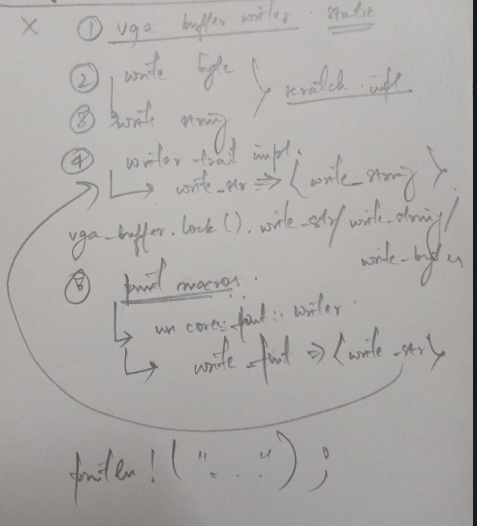

- Target-triple string is the discription of the environment in which the compiler compiles out executable.

- Bootable disk image contains the kernel, bootloader and the file system. So when the computer starts it looks for the bootable disk image and then the bootloader loads the kernal and inialises the hardware.

- The bootimage tool, compiles the kernel and bootloader separately and then links them together to create a bootable disk image.

- To rebuild the bootable disk image, and run the qemu VM, run:

```bash
cargo bootimage

qemu-system-x86_64 -drive format=raw,file=target/x86_64-os/debug/bootimage-bare-metal-os.bin
```

```bash
cargo run # if /.cargo/config.toml file is set
```

- QEMU is an emulator and a VM that can simulate different CPU architectures and hardware environments.

- To print a character in the VGA-text mode on the screen, we use the VGA-text-buffer of the VGA-hardware.

- VGA-buffer hardware exists at this address: `0xb8000` and we can execute read/write operations by pointing on the Buffer present at this address.

- When we are writing to the VGA-buffer, it is not being read again, so to prevent the compiler to optimize/free away that storage buffer because it seems unused, we use the `volatile` wrapper to prevent those compiler optimizations to happen.

- static variables are initialised at compile time, unlike others initialised at run time. `const fn` are functions that can be evaluated at compile time.

- #### The One-Time Initialization Problem with static in Rust: We cannot declare a static variable using `non-constant` functions. The initialisation requires computation that cannot be done at compile time. To go around this we use `lazy-static` crate.

- In a `spinlock` the thread keeps trying to aquire the lock in a loop, whereas in normal `mutex` all the threads are blocked if the mutex is locked.

- Controlflow of how `println!` macros are executed:


