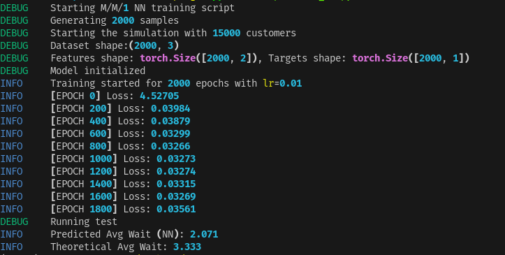

```
python -m venv .venv
. .venv/bin/activate
uv sync
python examples/mm1_ex.py
```

# Docs:

## Overall:

- Pick a λ and μ randomly:
    - λ = arrival rate, μ = service rate
    - For stability, μ is slightly bigger than λ, 

- Simulate a M/M/1 queue with 15000 customer
    - For each customer, generate their arrival time and service time using exponential distributions.
    - Compute whenthey start service, finish and their waiting time.
    - Take the avergae waiting time over all 15000 customers.

- Log-transform the average waiting time to stabalize extreme values.
- Repeat steps 1-3 for 2000 different λ, μ pairs
    - we get a dataset for 2000 rows: each row is `[λ, μ, log(avg_wait)]`

So basically 2000 different queues, each with 15000 customers, average waiting time computed for each. 

## Utils:

### 1. `generate_dataset.py`

- Generate a dataset for trainin a neural net to predict average waiting time in an M/M/1 queue.
- `n_samples` = 2000 -> create 2000 data points (rows), where each row: [λ, μ, log(avg_wait)]
- `customers` = 15000 -> count of customers/packets waiting in the mm1 queue as the start of each simulation.

```sql
Dataset (n_samples = 2000)
┌───────────────┬──────────┬───────────────┐
│ λ             │ μ        │ log(avg_wait) │  <- 1 row
└───────────────┴──────────┴───────────────┘
...
Total rows = n_samples

Each row: simulate M/M/1 queue with `customers = 15000` arrivals
┌───────────┐
│ Customer1 │  arrival+service
│ Customer2 │
│ ...       │
│ Customer15000 │
└───────────┘
Compute avg_wait over 15000 customers
``` 
### 2. `model.py`

- Predicts the log of average waiting time in an M/M/1 queue from λ and μ.
- Uses nn.Sequential to apply layers in sequence automatically.
- forward(x) passes input through all layers to compute output.

### 3. `simulation.py`

- Suppose we have:
    - Arrival rate λ = 0.5 → on average, 1 customer every 2 units of time
    - Service rate μ = 1 → on average, each customer takes 1 unit of time to be served
    - Simulate 5 customers (small number for example)
- Generate inter-arrival times
    - use exponential distribution:
        ```py
        np.random.exponential(1/lambda_rate, num_customers)
        ```
    - Random times of arrivals.
        - `Inter-arrival times: [2.0, 1.5, 0.5, 1.0, 0.8]`
        - `Arrival times: [2.0, 3.5, 4.0, 5.0, 5.8]`
        - Customer 1 arrives at t=2, Customer 2 at t=3.5, etc.
- Generate service times
    - Use exponential distribution.
        ```py
        service_times = np.random.exponential(1/mu_rate, num_customers)   
        ```
    - Random service times from exponential distribution:
        - `Service times: [1.2, 0.5, 0.8, 1.0, 0.7]`
        - Customer 1 takes 1.2 units, Customer 2 takes 0.5, etc.
-  Initialize arrays
    - Create arrays for start_service, finish and waiting times:
        ```ini
        start_service_times = [0, 0, 0, 0, 0]
        finish_times        = [0, 0, 0, 0, 0]
        waiting_times       = [0, 0, 0, 0, 0]
        ```
- Simulate each customer
    ```ini
    - Customer 1 (i=0)
        - Start service = arrival = 2.0 (no previous customer)
        - Finish = 2.0 + 1.2 = 3.2
        - Waiting = start - arrival = 2.0 - 2.0 = 0.0
    - Customer 2 (i=1)
        - Arrival = 3.5, previous finish = 3.2
        - Start = max(3.5, 3.2) = 3.5
        - Finish = 3.5 + 0.5 = 4.0
        - Waiting = 3.5 - 3.5 = 0.0
    - Customer 3 (i=2)
        - Arrival = 4.0, previous finish = 4.0
        - Start = max(4.0, 4.0) = 4.0
        - Finish = 4.0 + 0.8 = 4.8
        - Waiting = 4.0 - 4.0 = 0.0

    - Customer 4 (i=3)
        - Arrival = 5.0, previous finish = 4.8
        - Start = max(5.0, 4.8) = 5.0
        - Finish = 5.0 + 1.0 = 6.0
        - Waiting = 5.0 - 5.0 = 0.0

    - Customer 5 (i=4)
        - Arrival = 5.8, previous finish = 6.0
        - Start = max(5.8, 6.0) = 6.0
        - Finish = 6.0 + 0.7 = 6.7
        - Waiting = 6.0 - 5.8 = 0.2
    ```
- Now we average the waiting time and return the mean
    ```py
    np.mean(waiting_times)
    ```

### 4. We can also calculate the average idle time of the queue.

### 5. `mm1_ex.py`
- The overall mm1 queue simulation script.
- Generate the datasets
- Seperate the `(λ,μ)` values and `log(avg_wait)` in X and Y.
- Initialize the model
- Adam optimizer to update the neurl network's weights.
- MSELoss function, to measure how far the network's prediction is from the actual value.
- Training round:
    - `optimizer.zero_grad()`: Clears old gradients every backward pass.
    - `pred = model(X)`: Forward pass, make predictions on current training.
    - `loss = loss_fn(pred, y)`: error between the predictions and actual values.


### Simulation run



