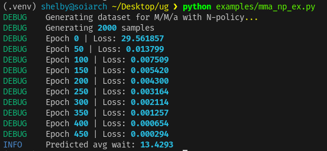

```
python -m venv .venv
. .venv/bin/activate
uv sync
python examples/mma_np_ex.py
```


## Overall:

* Pick random parameters: ( \lambda, \mu, a, N )

  * ( \lambda ): arrival rate (Poisson arrivals)
  * ( \mu ): service rate (Exponential service times)
  * ( a ): number of parallel servers
  * ( N ): threshold for N-policy activation (system activates when queue \u2265 N)
  * For stability, ( \mu > \lambda )

* Simulate an **M/M/a queue with N-policy** for 5000 customers:

  * Generate inter-arrival and service times using exponential distributions.
  * Customers accumulate in the queue until its length reaches N.
  * Once queue length \u2265 N, servers start working (system becomes active).
  * Each server processes one customer at a time; when all servers finish and queue empties, the system deactivates.
  * For every customer, compute waiting time (start time \u2212 arrival time).
  * Average these waiting times across all simulated customers.

* Repeat this for 2000 random parameter combinations.

  * Each simulation run yields one data point `[λ, μ, servers, N, avg_wait]`.

So basically: 2000 different queue systems, each simulating 5000 customers with their respective average waiting time.

---

## Utils:

### 1. `dataset.py`

* Generates the dataset for training a neural network to predict **average waiting time** in an **M/M/a with N-policy** queue.
* `samples` = 2000 → create 2000 different queue configurations.
* For each configuration:

  * Randomly sample λ, μ, servers, and N.
  * Run the simulation to get average waiting time.
* Return as NumPy arrays:

  * `X`: `[λ, μ, servers, N]`
  * `y`: `[avg_wait]`

```sql
Dataset (samples = 2000)
┌───────────────┬──────────┬──────────┬───────┬──────────────┐
│ λ             │ μ        │ servers  │  N    │ avg_wait     │
└───────────────┴──────────┴──────────┴───────┴──────────────┘
...
Total rows = samples

Each row corresponds to a full simulation run of 5000 customers.
```

---

### 2. `simulation.py`

Simulates the **M/M/a queue with N-policy** behavior:

* **Step 1:** Generate arrivals

  * Inter-arrival times ~ Exp(1/λ)
  * Arrival times = cumulative sum of inter-arrival times
* **Step 2:** Generate service times

  * Service times ~ Exp(1/μ)
* **Step 3:** Initialize simulation state

  * `server_free_times` = [0] * a (when each server becomes available)
  * `queue` = [] (customers waiting)
  * `active = False` (servers are off until queue \u2265 N)
* **Step 4:** Loop over all arrivals:

  * Add new arrival to queue
  * If queue length >= N and system inactive → activate servers
  * While active:

    * Assign waiting customers to any free servers
    * Update each server's free time and record waiting times
  * If queue becomes empty → deactivate servers again
* **Step 5:** Return mean of all waiting times.

This models the system cycling between **idle** and **busy** states.

#### Example Lifecycle

```
Time →  0      2      4      6      8
        |------|------|------|------|
Arrivals accumulate:  queue < N → idle
Queue hits N → servers start → active phase
Servers process until queue empty → idle again
```

---

### 3. `model.py`

* Neural network to predict average waiting time from `[λ, μ, servers, N]`.
* Input layer: 4 nodes (features)
* Output layer: 1 node (predicted avg_wait)
* Uses `nn.Sequential` to apply layers sequentially.
* Loss: Mean Squared Error (MSE)
* Optimizer: Adam

---

### 4. `mma_np.py`

* End-to-end script for the **M/M/a N-policy** experiment.
* Steps:

  1. Generate dataset using `dataset.py`
  2. Split into X (input) and y (target)
  3. Train neural net using `model.py`
  4. Log progress and visualize training loss
  5. Save trained model

```bash
Workflow
┌──────────────────────────────┐
│ 1. generate_dataset()        │ → create 2000 samples
│ 2. model = MLPModel()        │ → neural network
│ 3. Train w/ Adam optimizer   │
│ 4. Log loss + validate model │
└──────────────────────────────┘
```

---

### Conceptually

| System           | Description                                       |
| ---------------- | ------------------------------------------------- |
| M/M/1            | Single server, always active                      |
| M/M/a            | Multiple servers, always active                   |
| M/M/a + N-policy | Multiple servers, only active when queue \u2265 N |

The **N-policy** introduces an **on/off control mechanism**. The servers don’t continuously serve; they wait for enough demand before activating. This creates a trade-off between **efficiency** and **delay**:

* Small N → less waiting, more energy cost (servers active often)
* Large N → more waiting, but energy efficient

---

### Analogy

> Think of it as a coffee shop with several baristas. They don’t all come to work every time someone enters. Instead, they wait until there’s a crowd of N people, then everyone starts serving. Once the line is cleared, they all close the counter and rest again.

---

### Output

The neural net ultimately learns the mapping:

```
[λ, μ, servers, N]  →  avg_wait
```

which captures how queueing delay behaves in systems that turn on and off based on queue thresholds.

